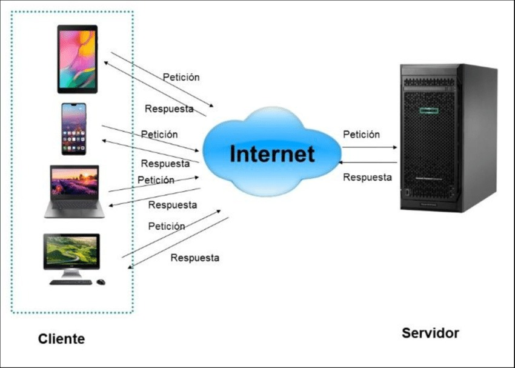
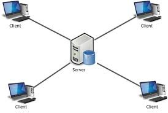

# patrones arquitectonicos
> [!NOTE] 
> 👍Un **patron arquitectonico**  es una solucion general y reutilizable a un problema comun en la arquitectura de software denro de un contexto dado. los patrones arquitectonicos son la habilidad de organizacion a nivel de carpetas dentro del proyecto de software

PATRONES ARQUITECTONICOS MAS CONOCIDOS

1. PATRON DE CAPAS
2. PATRON CLIENTE-SERVIDOR
3. PATRON MAESTRO-ESCLAVO
4. PATRON DE FILTRO DE TUBERIA
5. PATRON DE INTERMEDIO
6. PATRON DE IGUAL A IGUAL
7. PATRON DE BUS EVENTO
8. MODELO-VISTA-CONTROLADOR
9. ARQUITECTURA LIMPIA
10. ARQUTECTURA HEXAGONAL

## PATRON CLIENTE-SERVIDOR 
La arquitectura cliente-servidor es un modelo de diseño de software en el que las tareas se reparten entre los proveedores de recursos o servicios, llamados servidores, y los demandantes, llamados clientes. Un cliente realiza peticiones a otro programa, el servidor, quien le da respuesta.
### tareas puede hacer el cliente dentro de la arquitectura cliente-servidor
El cliente realiza la solicitud de un recurso o un servicio al servidor. Para ello envía una señal a través de la red, en la que entrega todas las características de la función que requiere que se realice. El servidor recibe la solicitud y procesa la entrada de datos enviada por el cliente, componiendo una respuesta.
### Tipos de Arquitectura Cliente Servidor
- Cliente Activo, Servidor Pasivo: El cliente realiza la practica totalidad del trabajo de procesado de la información. Ejemplo: Google Earth.
- Cliente Pasivo, Servidor Pasivo: Tanto el cliente como el Servidor simplemente pasan información. Ejemplo: Gateways de comunicaciones VoIP.
- Cliente Pasivo, Servidor Activo: El Servidor realiza todo el trabajo de procesado y el cliente simplemente presenta los datos. Ejemplo: Servidores de terminales.
- Cliente Activo, Servidor Activo: Tanto el Servidor como el Cliente procesan la información. Ejemplo: Servicios de Correo Electrónico.

### características generales son:
1. El Cliente y el Servidor pueden actuar como una sola entidad y también pueden actuar como entidades separadas, realizando actividades o tareas independientes
2. Las funciones de Cliente y Servidor pueden estar en plataformas separadas, o en la misma plataforma.
3. Cada plataforma puede ser escalable independientemente. Los cambios realizados en las plataformas de los Clientes o de los Servidores, ya sean por actualización o por reemplazo tecnológico, se realizan de una manera transparente para el usuario final.
4. La interrelación entre el hardware y el software está basada en una infraestructura poderosa, de tal forma que el acceso a los recursos de la red no muestra la complejidad de los diferentes tipos de formatos de datos y de los protocolos.
5. Su representación típica es un centro de trabajo (PC), en donde el usuario dispone de sus propias aplicaciones de oficina y sus propias bases de datos, sin dependencia directa del sistema central de información de la organización.

###  ejemplos:
1. Outlook es un cliente de correo que sirve para leer los correos del servicio hotmail.
   
2. WhatsApp o Telegram son clientes de servicios de chat, vídeo, audio.
   
3. Firefox es un cliente web, Chrome también ("navegadores")
4. 
5. Internet Information Server y Apache Web Server son servidores web.

### CONCLUSION
El objetivo principal de la arquitectura cliente-servidor es realizar la separación de las funciones y responsabilidades del software en distintas capas. La separación de responsabilidades es una de las bases sobre la que se sustenta el buen diseño del software.